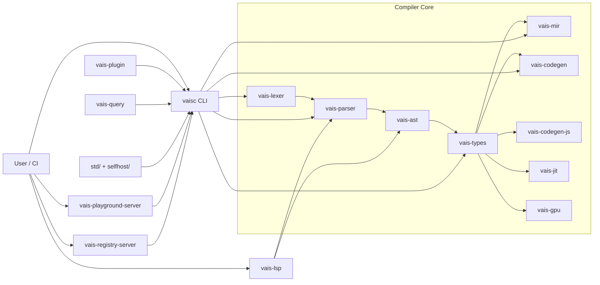
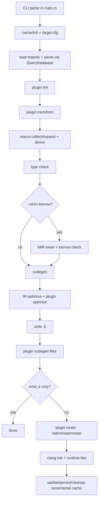
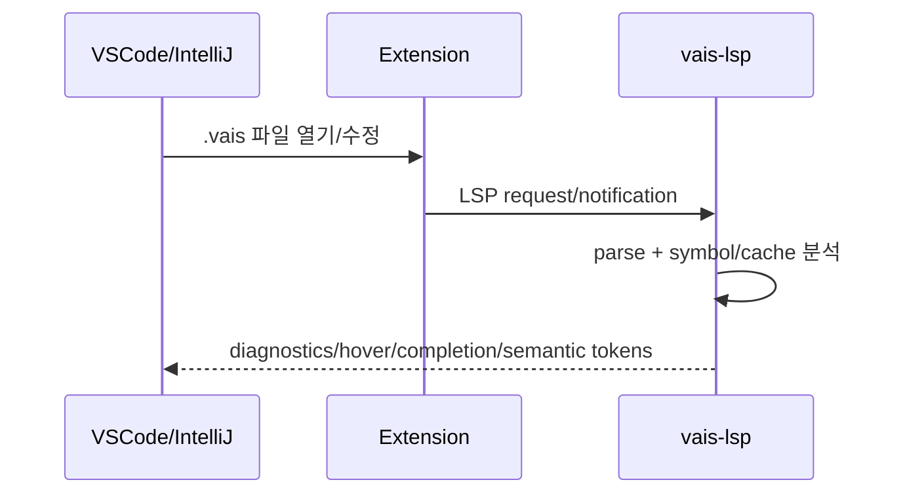
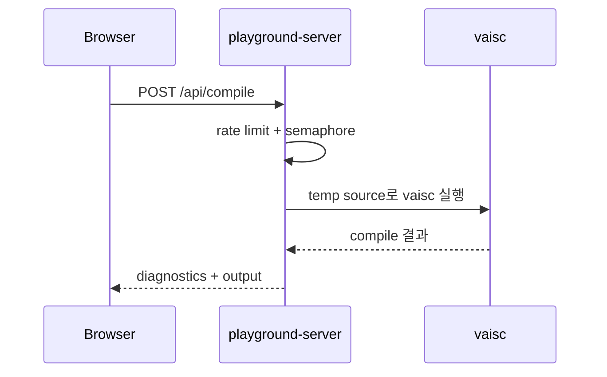

# Vais 구조/동작 한눈에 보기

이 문서는 `docs/Architecture.md`의 축약판입니다.
핵심 목표는 다음 3가지를 한 번에 파악하는 것입니다.

1. 저장소가 어떤 컴포넌트로 나뉘는지
2. `vaisc build`가 실제로 어떤 순서로 동작하는지
3. `run/check/LSP/Playground`가 컴파일 파이프라인을 어떻게 재사용하는지

---

## 1) 전체 구성(구조)

### Mermaid 다이어그램



### 텍스트 다이어그램(mdBook 폴백)

```text
[User/CI]
   |-- vaisc -------------------------------+
   |                                         |
   |-- vais-lsp (editor diagnostics)         |
   |-- vais-playground-server (REST)         |
   |-- vais-registry-server (package API)    |
                                             v
                         [Compiler Core Pipeline]
           lexer -> parser -> ast -> types -> mir -> codegen
                                    |        |        |
                                    |        |        +-> native/wasm
                                    |        +-> borrow check
                                    +-> js/jit/gpu backends

Cross-cutting: plugin, query-db, std/, incremental cache
```

---

## 2) `vaisc build` 동작 흐름

아래 흐름은 `crates/vaisc/src/commands/build/core.rs`를 기준으로 정리했습니다.

### Mermaid 다이어그램



### 텍스트 다이어그램(mdBook 폴백)

```text
CLI(main.rs)
  -> cache/init + target cfg
  -> parse/import (QueryDatabase)
  -> plugin lint
  -> plugin transform
  -> macro collect/expand + derive
  -> type check
  -> (optional) MIR borrow check (--strict-borrow)
  -> codegen (text or inkwell)
  -> IR optimize + plugin optimize
  -> write .ll
  -> plugin codegen
  -> [emit_ir ? done : target router(native/wasm/wasi)]
  -> clang link + runtime libs
  -> incremental cache update/persist/cleanup
```

### 핵심 단계 요약

| 단계 | 실제 동작 |
|---|---|
| 입력/캐시 준비 | 변경 파일 탐지, 타깃/옵션/feature cfg 설정 |
| 파싱 + import 해석 | 단일 또는 병렬 import 로딩, `modules_map` 생성 |
| 플러그인 전처리 | lint -> transform 순서 적용 |
| 매크로 단계 | 매크로 수집/확장 + `derive` 처리 |
| 타입 단계 | 시그니처 불변이면 type check skip 가능, 필요 시 병렬 타입체크 |
| 소유권/대여 단계 | `--strict-borrow` 시 MIR borrow checker 추가 실행 |
| 코드생성 단계 | 텍스트 IR backend 또는 inkwell backend |
| 최적화 단계 | O0~O3 + PGO/LTO + plugin optimize |
| 출력 단계 | `.ll` 기록, 필요 시 native/wasm 링크 |
| 마무리 | incremental cache 업데이트/정리 |

---

## 3) 명령별 동작 차이 (`build / run / check / repl`)

| 명령 | 어디까지 수행? | 특징 |
|---|---|---|
| `vaisc build` | 전체 파이프라인 | import, macro, type, codegen, optimize, link |
| `vaisc run` | `build` + 실행 | 내부적으로 먼저 `cmd_build`를 호출 후 바이너리 실행 |
| `vaisc check` | tokenize/parse/typecheck | 바이너리 생성 없이 정적 오류만 확인 |
| `vaisc repl` | parse/typecheck + 실행 루프 | 입력 단위로 컴파일/실행(환경 유지) |

---

## 4) 주변 컴포넌트가 파이프라인을 쓰는 방식

### 4-1) Editor/LSP



```text
IDE -> Extension -> vais-lsp
                 -> parse + symbol cache
                 -> diagnostics / hover / completion / semantic tokens
                 -> IDE
```

- `vscode-vais`는 `vais-lsp` 프로세스를 실행하고 파일 변경 이벤트를 전달합니다.
- `vais-lsp`는 문서를 파싱하고 진단/참조/호버/시맨틱 토큰을 응답합니다.

### 4-2) Playground



```text
Browser
  -> POST /api/compile
Playground Server
  -> rate-limit + concurrency guard
  -> invoke vaisc (temp source)
  <- compile/run result
  -> diagnostics/output JSON
Browser
```

- 서버가 직접 컴파일 로직을 재구현하지 않고 `vaisc`를 호출합니다.
- 따라서 CLI와 Playground의 결과 일관성이 높습니다.

---

## 5) 코드 읽기 추천 순서 (빠른 온보딩)

1. `crates/vaisc/src/main.rs` (명령 라우팅)
2. `crates/vaisc/src/commands/build/core.rs` (핵심 파이프라인)
3. `crates/vaisc/src/imports.rs` (import 해석/병합)
4. `crates/vaisc/src/commands/compile/native.rs` (clang 링크/런타임 결합)
5. `crates/vaisc/src/commands/compile/per_module.rs` (모듈별 병렬 코드생성)
6. `crates/vais-query/src/lib.rs` (질의 기반 캐시 개념)
7. `crates/vais-plugin/src/traits.rs` (확장 포인트)

---

## 6) 관련 상세 문서

- 전체 상세: `docs/Architecture.md`
- 컴파일러 내부(요약+실습): `docs-site/src/compiler/internals.md`
- 기술 스펙: `docs-site/src/compiler/tech-spec.md`
